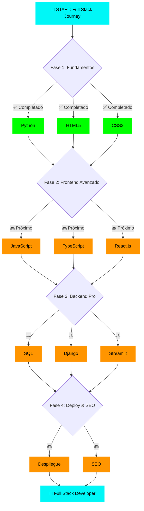

<div align="center">

# `<HACHE/>`

[](https://git.io/typing-svg)

---

### 👨‍💻 Hayson | Full Stack Developer in Progress

</div>

---

## 🌊 Sobre mí

```javascript
const hache = {
    nombre: "Hayson",
    aka: "Hache",
    ubicacion: "Menorca, ES 🇪🇸",
    educacion: "Máster Full Stack Development @ Conquer Blocks",
    estadoActual: "Dominando Python, HTML, CSS | Próximo: JavaScript",
    objetivo: "Convertirme en Full Stack Developer completo",
    lema: "Code, Learn, Repeat 🔁"
};
```

<div align="center">

### 🎯 Actualmente

📚 Cursando **Máster Full Stack** en Conquer Blocks  
💻 Dominando **Python, HTML, CSS**  
🔜 Próximamente: **JavaScript, TypeScript, React**  
🔨 Construyendo proyectos para fortalecer mis skills  
🚀 Explorando arquitectura backend y buenas prácticas

</div>

---

## 🛠️ Tech Stack

<div align="center">

### ✅ Tecnologías Dominadas


### 🔜 Próximas en el Roadmap


</div>

---

## 🎓 Mi Roadmap - Conquer Blocks Full Stack

<div align="center">



**Leyenda:** ✅ Dominado | 🔜 En el horizonte

</div>

---

## 💼 Stack Organizado por Categorías

<div align="center">

### 🎨 Frontend Development
```
✅ HTML5 ▰▰▰▰▰▰▰▰▰▰ 100%
✅ CSS3  ▰▰▰▰▰▰▰▰▰▰ 100%
🔜 JavaScript ▱▱▱▱▱▱▱▱▱▱ 0%
🔜 TypeScript ▱▱▱▱▱▱▱▱▱▱ 0%
🔜 React      ▱▱▱▱▱▱▱▱▱▱ 0%
```

### ⚙️ Backend Development
```
✅ Python  ▰▰▰▰▰▰▰▰▰▰ 100%
✅ FastAPI ▰▰▰▰▰▰▰▰▱▱ 80%
🔜 SQL      ▱▱▱▱▱▱▱▱▱▱ 0%
🔜 Django   ▱▱▱▱▱▱▱▱▱▱ 0%
```

### 📊 Data & Deployment
```
🔜 Streamlit  ▱▱▱▱▱▱▱▱▱▱ 0%
🔜 Despliegue ▱▱▱▱▱▱▱▱▱▱ 0%
🔜 SEO        ▱▱▱▱▱▱▱▱▱▱ 0%
```

</div>

---

## 🔥 Estado Actual del Viaje

<div align="center">

| 🎯 Meta Actual | 📚 En Aprendizaje | 🚀 Próximo Paso |
|:---:|:---:|:---:|
| Dominar Backend | Python + FastAPI | JavaScript & TS |

</div>

```python
# Mi filosofía de código
def mi_enfoque():
    habilidades_dominadas = ["Python", "HTML", "CSS", "FastAPI"]
    proximo_nivel = ["JavaScript", "TypeScript", "React"]
    meta = "Full Stack Developer"
    
    while meta != "alcanzada":
        aprender()
        practicar()
        construir_proyectos()
        compartir_conocimiento()
    
    return "¡Objetivo cumplido! 🎉"

# Mantra del día
print("Cada línea de código es un paso hacia mi objetivo 🎯")
```

---

## 📫 Hablemos

<div align="center">

### Encuentra mi código aquí 👇

[](https://github.com/TU_USERNAME)
[](https://linkedin.com/in/tu-perfil)
[](mailto:tu-email@example.com)

<br>

### 💭 Quote Random de Programación

[](https://github.com/piyushsuthar/github-readme-quotes)

<br>

---

### 🌟 "El mejor momento para plantar un árbol fue hace 20 años. El segundo mejor momento es ahora."

*Lo mismo aplica para aprender a programar* 💻

<br>


<br>

**💡 Si algo de mi perfil te resulta útil, sígueme y dale ⭐ a mis repos**

</div>
