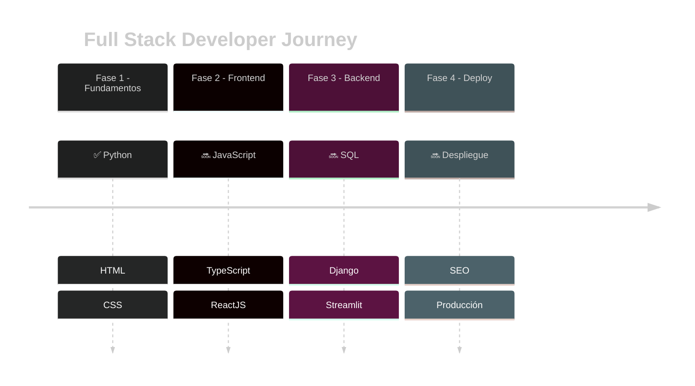

<div align="center">

# `<HACHE/>`

[](https://git.io/typing-svg)

---

### 👨‍💻 Hayson | Full Stack Developer in Progress

</div>

---

## 🌊 Sobre mí

```javascript
const hache = {
    nombre: "Hayson",
    aka: "Hache",
    ubicacion: "Menorca, ES 🇪🇸",
    educacion: "Máster Full Stack Development @ Conquer Blocks",
    estadoActual: "Dominando Python, HTML, CSS | Próximo: JavaScript",
    objetivo: "Convertirme en Full Stack Developer completo",
    lema: "Code, Learn, Repeat 🔁"
};
```

<div align="center">

### 🎯 Actualmente

📚 Cursando **Máster Full Stack** en Conquer Blocks  
💻 Dominando **Python, HTML, CSS**  
🔜 Próximamente: **JavaScript, TypeScript, React**  
🔨 Construyendo proyectos para fortalecer mis skills  
🚀 Explorando arquitectura backend y buenas prácticas

</div>

---

## 🛠️ Tech Stack

<div align="center">

### ✅ Tecnologías Dominadas


### 🔜 Próximas en el Roadmap


</div>

---

## 📊 GitHub Activity

<div align="center">

### 🔥 Mis Contribuciones

A medida que voy construyendo proyectos y aprendiendo, mi actividad en GitHub va creciendo.  
Aquí puedes ver mi progreso y los lenguajes que más utilizo.

[](https://github.com/TU_USERNAME)

[](https://github.com/TU_USERNAME)

</div>

---

## 🎓 Mi Roadmap de Aprendizaje - Conquer Blocks

<div align="center">



</div>

---

## 💼 Áreas de Especialización

<div align="center">

| Categoría | Tecnologías |
|-----------|-------------|
| **Frontend** | HTML5, CSS3, JavaScript (próximo), TypeScript (próximo), React (próximo) |
| **Backend** | Python, FastAPI, Django (próximo), SQL (próximo) |
| **Data & Viz** | Streamlit (próximo) |
| **DevOps** | Git, Despliegue (próximo) |
| **Optimización** | SEO (próximo) |

</div>

---

## 🚀 Enfoque Actual

```python
class MiViaje:
    def __init__(self):
        self.fase_actual = "Dominando Backend con Python"
        self.tecnologias_dominadas = ["Python", "HTML", "CSS", "FastAPI"]
        self.proximo_objetivo = "JavaScript & TypeScript"
        self.meta_final = "Full Stack Developer"
    
    def siguiente_paso(self):
        return "Construir proyectos reales con las tecnologías aprendidas"
    
    def mantra(self):
        return "Cada línea de código es un paso hacia mi objetivo 🎯"
```

---

## 📫 Conecta Conmigo

<div align="center">

[](https://github.com/TU_USERNAME)
[](https://linkedin.com/in/tu-perfil)
[](mailto:tu-email@example.com)

---

### ⚡ *"El mejor momento para aprender fue ayer. El segundo mejor momento es ahora."*


---

💡 **Tip:** Si encuentras útil alguno de mis proyectos, ¡dale una ⭐!  
🌱 Siempre abierto a colaborar y aprender de la comunidad

</div>
