<div align="center">

# `<HACHE/>`

[](https://git.io/typing-svg)

---

### 👨‍💻 Hayson | Backend Developer in Progress

</div>

---

## 🌊 Sobre mí

```javascript
const hache = {
    nombre: "Hayson",
    aka: "Hache",
    ubicacion: "Menorca, ES 🇪🇸",
    educacion: "Máster en Desarrollo Web",
    enfoque: ["Backend Development", "API Design", "Clean Code"],
    estadoActual: "Aprendiendo y construyendo proyectos",
    objetivo: "Convertirme en Full Stack Developer",
    lema: "Code, Learn, Repeat 🔁"
};
```

<div align="center">

### 🎯 Actualmente

📚 Estudiando mi Máster en Desarrollo Web  
💻 Practicando desarrollo backend con Python & FastAPI  
🔨 Construyendo proyectos para fortalecer mis skills  
🚀 Explorando arquitectura backend y buenas prácticas

</div>

---

## 🛠️ Tech Stack

<div align="center">

### 💻 Lenguajes y Tecnologías


### 🌱 Aprendiendo


</div>

---

## 📊 GitHub Stats

<div align="center">


</div>

---

## 🎯 Mi Viaje de Aprendizaje

```mermaid
graph LR
    A[🎓 Fundamentos Web] --> B[🐍 Python]
    B --> C[⚡ FastAPI]
    C --> D[🗄️ Bases de Datos]
    D --> E[🐳 Docker]
    E --> F[☁️ Cloud Deploy]
    F --> G[🚀 Full Stack]
    
    style A fill:#1a1b27,stroke:#00f7f7,stroke-width:2px,color:#fff
    style B fill:#1a1b27,stroke:#00f7f7,stroke-width:2px,color:#fff
    style C fill:#1a1b27,stroke:#00f7f7,stroke-width:2px,color:#fff
    style D fill:#1a1b27,stroke:#00f7f7,stroke-width:2px,color:#fff
    style E fill:#1a1b27,stroke:#00aaf7,stroke-width:2px,color:#fff
    style F fill:#1a1b27,stroke:#00aaf7,stroke-width:2px,color:#fff
    style G fill:#1a1b27,stroke:#00aaf7,stroke-width:2px,color:#fff
```

<div align="center">



</div>

---

## 📫 Conecta Conmigo

<div align="center">

[](https://github.com/TU_USERNAME)
[](https://linkedin.com/in/tu-perfil)
[](mailto:tu-email@example.com)

</div>

---

<div align="center">

### 💭 Quote del Día


---

### ⚡ *"El código es poesía, y yo estoy aprendiendo a escribir"*


**⭐ Si te gusta mi trabajo, sígueme y dale estrella a mis repos**

</div>
